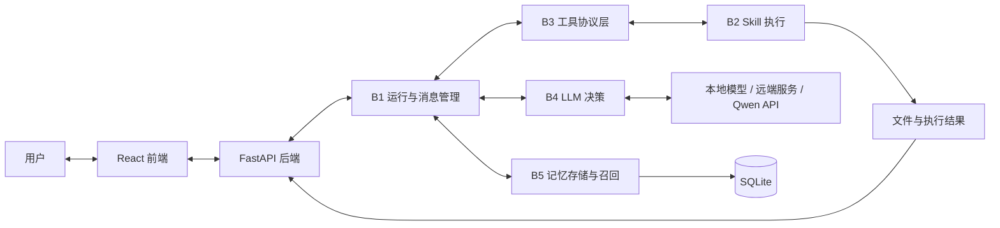

# 本地 Agent 智能体实训系统

> 人工智能实训 B 方向团队项目。系统以 B1-B5 五个解耦模块为核心，提供 React + FastAPI 浏览器界面，支持多轮对话、工具调用、长期记忆、流式输出和文件交付。

---

## 1. 项目概述

### 1.1 项目名称

`本地 Agent 智能体实训系统`

### 1.2 项目目标

本项目面向本地工具型 Agent 场景，实现从用户输入、上下文组织、模型决策、工具执行到记忆持久化的完整闭环。系统既保留 B1-B5 模块的独立入口和固定协议，也通过 Web 主链路将五个模块组合为可交互、可观察、可恢复的完整应用。

系统主要能力包括：

- 维护标准消息序列并完成多轮 `LLM -> Tool -> LLM` 循环；
- 读取本地及上传文件，执行计算、表格分析、网页搜索和 Python 沙箱任务；
- 生成 TXT、Markdown、代码、JSON、DOCX、CSV/TSV 等可下载文件；
- 保存会话、消息和工具步骤，构建轮级摘要、块级记忆和任务记忆；
- 支持流式回答、会话级系统提示词、取消、检查点与断点恢复；
- 提供 B1-B5 观察页和独立演示页，用于模块验收。

### 1.3 当前完成情况

| 类型 | 完成情况 |
|---|---|
| 基础要求 | B1-B5 独立接口及完整调用链均已实现。B1 管理消息和运行状态；B2 提供 15 个 Skill；B3 生成 schema 并执行 tool calls；B4 负责模型通信和标准 AIMessage 解析；B5 负责会话存储、压缩和召回。 |
| 进阶要求 | 已实现多轮工具循环、流式输出、Workspace 状态控制、会话级 prompt 热更新、取消与断点恢复、分层记忆、向量召回、LLM rerank、文件上传与 artifact 下载。 |
| 支持的主要任务类型 | 普通问答、文件与 Office 文档读取、目录浏览、内容检索、表格分析、数学计算、时间查询、网页搜索、Python 代码执行及多类型文件生成。 |
| 当前限制 | Web 搜索质量受公开搜索源影响；API 模型依赖网络和额度；本地模型模式受显存与推理环境限制；Python 沙箱不是容器级安全隔离；尚未提供独立批量任务 runner。 |

---

## 2. 整体流程与模块结构

### 2.1 模块边界

| 模块 / 阶段 | 入口文件 / 入口函数 | 主要职责 | 输入 | 输出 |
|---|---|---|---|---|
| B1 Agent 运行与消息管理 | `code/b1_agent_runtime.py`：`run()`、`run_stream()`、`resume_stream()` | 组织输入、prompt、memory、消息和 Workspace，控制状态转移、工具循环、取消、恢复与最终输出。 | RuntimeInput、历史消息、MemoryContext、AIMessage、ToolMessage | 标准消息、运行轨迹、最终回答、checkpoint、流式事件 |
| B2 Skill 工具函数 | `code/b2_run_skill.py`：`run_skill()`、`skills/*.py` | 执行确定性的文件、搜索、计算、表格和代码任务，不参与 Agent 决策。 | Skill 名称、JSON 参数、工作目录 | 统一 SkillResult、生成文件 |
| B3 说明生成与工具调用 | `code/b3_tool_layer.py`：`get_tools_schema()`、`execute_tool_calls()` | 从配置生成 tools schema，校验 tool calls，调用 B2 并封装 ToolMessage。 | `tools.yaml`、toolset、ToolCall 列表 | tools schema、ToolMessage、调用日志与统计 |
| B4 Agent LLM 决策 | `code/b4_local_agent_llm.py` | 读取模型配置，发送标准 messages，接收完整或流式输出，解析标准 AIMessage/JSON。 | `model.yaml`、messages、tools schema、可选图片 | 原始模型输出、AIMessage、LLM 日志 |
| B5 记忆文档存储与查找 | `code/b5_memory.py`、`code/b5_memory_parts/` | 持久化消息与工具步骤，生成摘要、记忆块和任务状态，为 B1 组织召回上下文。 | 会话 ID、当前问题、历史消息、工具步骤 | SQLite 记录、MemoryContext、召回日志与来源证据 |
| FastAPI 后端 | `backend/main.py` | 对外提供会话、上传、运行、流式、取消恢复、artifact 和模块演示 API。 | HTTP 请求、上传文件 | JSON/NDJSON 响应、运行产物 |
| React 前端 | `frontend/src/App.tsx` | 提供聊天、历史会话、上传下载、工具过程和 B1-B5 观察/演示界面。 | 用户操作、后端事件 | 浏览器交互界面 |
| LLM 服务 | `llm_backend/server/`、`llm_backend/qwen_api/` | 封装学校服务器模型或 Qwen API，向 B4 提供统一生成与流式接口。 | 模型请求 | 文本、流式 token、向量 |

模块边界遵循以下原则：B1 只编排信息流；B2 只实现工具；B3 只处理工具协议和执行；B4 只处理模型通信；B5 只处理记忆存储、压缩与召回。

### 2.2 系统架构图



### 2.3 一次完整任务的流程

1. 用户在浏览器输入任务，可同时上传文件；CLI 演示则从 Runtime JSON 读取输入。
2. 后端规范化会话 ID、用户输入、文件引用和会话级 system prompt，并调用 B1。
3. B1 向 B5 提交当前问题和会话 ID。B5 返回近期原文、召回轮次、任务记忆、块级记忆及来源信息。
4. B1 将 system prompt、memory context、历史消息和当前输入写入 Workspace，并从 B3 获取当前 tools schema。
5. B1 按 `planning -> tool_calling -> observation -> answering` 推进任务；每次状态判断均通过 B4 获得标准 AIMessage。
6. AIMessage 包含 tool calls 时，B1 将其交给 B3。B3 校验名称和参数后调用 B2，并把统一 SkillResult 封装为 ToolMessage 返回 B1。
7. B1 将模型输出、工具结果和观察结论写回 Workspace，继续决策；独立工具可在同一轮批量调用。
8. 任务完成后，最终回答通过 NDJSON 流返回前端；生成文件转换为独立 artifact 字段和下载卡片。
9. 后端将用户消息、AI 回答和工具步骤写入 B5。B5 异步生成轮级摘要、任务记忆和块级压缩，供后续对话召回。
10. 每次运行保存 messages、trace、LLM 日志和工具日志；可恢复状态另存为会话级 checkpoint，支持观察、排错与恢复。

---

## 3. 模型、数据集与外部资源

### 3.1 模型说明

模型源由 `configs/model.yaml` 中的 `runtime.llm_source` 选择，三种来源共享 B4 的标准输入输出协议。

| 项目 | 内容 |
|---|---|
| 使用模型 | 默认 `qwen-plus`；可切换本地/远端 `Qwen3.5-4B` |
| 模型来源 | Qwen API，或 [ModelScope Qwen3.5-4B](https://modelscope.cn/models/Qwen/Qwen3.5-4B) |
| 项目内相对路径 | 本地权重默认放在 `models/Qwen3.5-4B`；实际路径由 `configs/model.yaml` 指定 |
| 是否需要 GPU | `qwen_api` 和远端 `fastapi` 模式本机不需要；`local` 模式通常需要 |
| 是否需要联网运行 | `qwen_api`、远端模型、网页搜索和默认 embedding 需要；本地模型准备完成后可离线运行 |

B5 默认使用 `text-embedding-v4` 进行向量召回。Embedding 或 LLM rerank 不可用时，B5 会保留状态并降级到非向量召回，而不会丢失原始消息。

### 3.2 数据集 / 示例数据说明

项目不包含训练流程，也不依赖训练数据集。`data/` 中的内容用于模块演示和完整链路测试。

| 数据或文件 | 用途 | 来源 | 项目内相对路径 |
|---|---|---|---|
| Runtime 样例 | 完整 CLI Agent 任务 | 项目自带 | `data/runtime_input.json`、`data/runtime_input_*.json` |
| B1 Fixture | 无真实模型条件下测试消息与工具闭环 | 项目自带 | `data/b1_fixtures/` |
| Skill 输入 | B2 正常、异常及边界样例 | 项目自带 | `data/tool_inputs/` |
| AIMessage 样例 | B3 ToolCall 校验与执行 | 项目自带 | `data/messages/` |
| 文档与表格 | 文件读取、检索和表格分析 | 项目自带 | `data/docs/`、`data/tables/` |
| 用户上传 | Web 运行时任务输入 | 用户提供 | `data/uploads/<conversation_id>/` |
| 课程资料 | 项目要求和文档模板 | 校方提供 | `docs/` |

---

## 4. 环境安装

### 4.1 运行环境

| 项目 | 要求 |
|---|---|
| Python 版本 | Python 3.10 |
| 操作系统 / 服务器环境 | Windows 或 Linux；本地模型服务可部署在独立 GPU 服务器 |
| GPU 要求 | API/远端模式无本机 GPU 要求；本地 Transformers 模式通常需要 CUDA GPU |
| 主要依赖 | FastAPI、Uvicorn、Pydantic、PyYAML、NumPy、DDGS、LangChain OpenAI；本地模式另需 PyTorch、Transformers、Accelerate |
| 前端环境 | Node.js `^20.19.0` 或 `>=22.12.0`，React 19，TypeScript，Vite 8 |

### 4.2 安装步骤

```bash
# 1. 创建并进入 Python 环境
conda create -n agent python=3.10 -y
conda activate agent

# 2. API / 远端模式使用轻量依赖
pip install -r requirements_fastapi.txt

# 本地 Transformers 模式改用完整依赖
# pip install -r requirements.txt

# 3. 安装前端依赖
cd frontend
npm ci
cd ..
```

默认 `qwen_api` 模式需要在项目根目录创建 `.env`：

```dotenv
QWEN_API_KEY=<your-api-key>
QWEN_MODEL=qwen-plus
QWEN_EMBEDDING_MODEL=text-embedding-v4
```

常见环境问题：

- API 模式需要确保 `.env`、网络、额度和模型名称有效；
- 本地模式需要同步修改 `configs/model.yaml` 中的模型与 tokenizer 路径；
- Node.js 版本过低时，Vite 8 无法启动；
- 不要将 API key、服务器密码或真实会话数据提交到 Git。

---

## 5. 输入文件与配置文件说明

### 5.1 主要配置文件

| 配置文件 | 作用 | 需要修改的字段 |
|---|---|---|
| `configs/model.yaml` | 配置 B4 模型源、生成参数和服务地址 | `runtime.llm_source`、`model.*`、`generation.*`、`fastapi.*`、`qwen_api.*` |
| `configs/tools.yaml` | 注册 B2 Skill，并为 B3 定义 toolset、schema 和工作区策略 | `default_toolset`、`settings.*`、`toolsets`、`tools` |
| `configs/memory.yaml` | 配置 B5 SQLite、上下文长度、向量召回和 rerank | `conversation_db_path`、`max_memory_chars`、`retrieval.*` |
| `prompts/agent_system_prompts.json` | 保存不可修改的默认系统提示词 | 默认 prompt 内容 |
| `prompts/b1_stage_prompts.json` | 管理 B1 各 Workspace 阶段提示词 | planning、observation、answering 等阶段内容 |
| `prompts/conversation_prompts.json` | 保存会话级 system prompt 副本 | `default_prompt_id`、会话 ID 对应内容 |
| `.env` | 保存 Qwen API 和 embedding 环境变量 | `QWEN_API_KEY`、`QWEN_MODEL`、`QWEN_EMBEDDING_MODEL` |

`basic_tools` 当前注册 15 个工具：

| 类别 | 工具 |
|---|---|
| 计算与时间 | `calculator`、`current_time` |
| 文件浏览与读取 | `directory_list`、`file_stat`、`file_reader`、`local_file_search` |
| 文件生成 | `text_file_writer`、`markdown_file_writer`、`code_file_writer`、`json_file_writer`、`docx_writer`、`table_file_writer` |
| 数据、联网与执行 | `table_analyzer`、`web_search`、`python_sandbox` |

### 5.2 主要输入文件

| 输入文件 | 用途 | 适用场景 |
|---|---|---|
| `data/runtime_input.json` | 读取文档并总结，验证 B1-B5 完整调用链 | 完整系统 CLI Demo |
| `data/b1_fixtures/b1_fixture_input.json` | 使用预设 Memory、AIMessage 和 ToolMessage | B1 独立演示 |
| `data/tool_inputs/*.json` | 验证 B2 各 Skill 的正常与异常输入 | B2 模块演示 |
| `data/messages/ai_message_with_tool_calls.json` | 执行标准 tool calls | B3 模块演示 |
| `data/messages/messages_*.json` | 验证无工具、成功工具和失败工具后的模型输入 | B4 模块演示 |
| `data/docs/*`、`data/tables/results.csv` | 验证文档读取、搜索和表格分析 | B2/完整系统 |

---

## 6. 完整流程 Demo 运行

### 6.1 Demo 样例说明

| Demo | 输入文件 / 输入内容 | 演示目的 |
|---|---|---|
| Web 文档任务 | 上传 DOCX，输入“读取文档并总结，生成总结后的文档” | 验证上传、B5 上下文、模型决策、文件读取、文档生成、流式输出和下载 |
| Web 代码任务 | “生成一个 Python 加法脚本，用 1+2.1 测试并给出文件” | 验证多工具调用、Python 沙箱、artifact 生成和下载 |
| Web 多轮记忆 | 在同一会话给出事实，经过多轮后再次询问 | 验证 SQLite 持久化、轮级压缩、块级压缩和召回 |
| CLI 完整任务 | `data/runtime_input.json` | 验证最初 B1-B5 文件协议和完整 Demo 入口仍可运行 |

### 6.2 运行命令

一键启动当前 Web 主链路：

```bash
python start_all.py
```

启动成功后浏览器打开 `http://127.0.0.1:5173`。默认依次启动 Qwen API 代理、FastAPI 后端和 Vite 前端；具体模型源由 `configs/model.yaml` 决定。

运行课程初始完整 CLI 链路：

```bash
python code/run_full_demo.py --input data/runtime_input.json --tools_config configs/tools.yaml --memory_config configs/memory.yaml --model_config configs/model.yaml --llm_mode prompt_json --outdir outputs/full_demo
```

不调用真实模型的 B1 Fixture：

```bash
python code/b1_agent_runtime.py --input data/b1_fixtures/b1_fixture_input.json --outdir outputs/B1_fixture
```

### 6.3 关键参数说明

| 参数 | 说明 |
|---|---|
| `--input` | B1 Runtime JSON 输入路径 |
| `--tools_config` | B3/B2 工具配置路径 |
| `--memory_config` | B5 记忆配置路径 |
| `--model_config` | B4 模型配置路径 |
| `--llm_mode` | `prompt_json` 使用真实模型协议；`mock` 仅用于接口调试 |
| `--outdir` | 本次运行产物目录 |
| `max_turns` | 单次任务允许的最大循环轮数，默认演示配置为 10 |

### 6.4 运行成功的判断方式

- `start_all.py` 显示模型服务、后端和前端均 ready，浏览器能够打开；
- 普通问题能够流式返回最终回答；
- 工具任务能够展示“已处理”过程，并产生正确的 ToolMessage；
- 文件生成任务出现下载卡片，且文件真实存在于本次运行的 `generated_files/`；
- CLI 输出目录包含 `messages.json`、`trace.json` 和 `final_answer.md`；
- B5 页面能够查看原始轮次、摘要、记忆块、召回记录和拼给 B1 的上下文。

---

## 7. 输出文件与结果说明

### 7.1 主要输出文件

| 输出文件 | 生成模块 / 阶段 | 格式 | 说明 |
|---|---|---|---|
| `outputs/backend_runs/<conversation>/<run>/messages.json` | B1 | JSON | 本次任务的标准消息序列 |
| `outputs/backend_runs/<conversation>/<run>/trace.json` | B1 | JSON | Workspace 状态、模型调用、工具轮次和错误轨迹 |
| `outputs/backend_runs/<conversation>/<run>/final_answer.md` | B1 | Markdown | 面向用户的最终回答 |
| `checkpoints/<conversation_id>.json` | B1 | JSON | 中断后恢复所需的会话级运行状态 |
| `outputs/backend_runs/<conversation>/<run>/tools_schema.json` | B3 | JSON | 当前 toolset 的标准工具 schema |
| `outputs/backend_runs/<conversation>/<run>/tool_messages.json` | B3 | JSON | 返回 B1 的 ToolMessage 列表 |
| `outputs/backend_runs/<conversation>/<run>/tool_call_log.jsonl` | B3/B2 | JSONL | 工具参数、结果、错误和耗时 |
| `outputs/backend_runs/<conversation>/<run>/llm_calls/` | B4 | JSON/JSONL | 模型输入、原始输出、AIMessage 和调用日志 |
| `outputs/backend_runs/<conversation>/<run>/workspace_memory_context.json` | B5 -> B1 | JSON | 本轮实际使用的近期历史、召回内容和来源信息 |
| `outputs/backend_runs/<conversation>/<run>/generated_files/` | B2 | 多种格式 | Agent 生成并可下载的文件 |
| `memory/conversation_store.sqlite3` | B5 | SQLite | 会话、消息、工具步骤、摘要、任务、记忆块和召回日志 |
| `outputs/startup_logs/` | 启动脚本 | Log | 模型代理、后端和前端启动日志 |

### 7.2 实际运行截图

以下图片均来自项目真实 Web 运行记录。文档只把已经产生后端结果的页面作为运行证据，不使用尚未点击执行的演示配置页冒充结果。

#### 主对话与文件交付


该任务同时验证了文件上传、模型决策、工具调用、文档生成、代码文件生成和 artifact 下载。

#### B1-B5 真实模块观察

| 模块 | 可核查的运行证据 | 实际截图 |
|---|---|---|
| B1 Agent 运行与消息管理 | 执行轨道、消息流、Workspace、checkpoint 和最终状态 |  |
| B2 Skill 工具函数 | 多次 Skill 的输入、输出、耗时、成功与错误状态 |  |
| B3 说明生成与工具调用 | tool calls 解析、参数校验、B2 分发、ToolMessage 和真实 schema |  |
| B4 Agent LLM 决策 | 模型配置、调用分类、原始输出和解析后 JSON |  |
| B5 记忆文档存储与查找 | 近期原文、轮摘要、记忆块、任务记忆和 B1 上下文 |  |

#### B1 独立状态流演示


B1 演示页已经加载真实 Workspace 快照，能够看到 `answering` 状态、最终回答、工具调用信息和运行轨迹。`images/` 中保留的 B2-B5 演示页图片为执行前界面，仅用于说明交互入口，因此不在本节作为结果证据展示。

---

## 8. 协作实现说明

- **固定模块边界**：B1-B5 均保留独立入口，模块之间只传递约定数据，不直接访问对方内部状态。
- **统一协议**：RuntimeInput、AIMessage、ToolCall、ToolMessage、SkillResult 和 MemoryContext 使用结构化 JSON；公共结构和校验集中在 `code/common/`。
- **配置驱动**：模型、工具和记忆分别由 `model.yaml`、`tools.yaml` 和 `memory.yaml` 管理，减少跨模块修改。
- **样例驱动联调**：`data/` 为各模块提供正常与异常输入，可先完成模块验收，再接入 Web 完整链路。
- **旁路可观察**：后端将 B1-B5 的运行产物转换为观察页数据，不改变核心模块执行过程。
- **产物隔离**：用户上传、运行输出、生成文件、模型日志和持久化记忆按目录分离，便于排错和清理。
- **版本协作**：合并前检查模块接口、配置和样例，冲突优先依据固定协议和当前 Web 主链路处理，避免用旧实现覆盖现有功能。

完整任务依赖多模块共同完成。例如“读取上传的 DOCX 并生成总结文档”同时涉及前端上传、后端路径规范化、B1 编排、B5 上下文、B4 决策、B3 调用校验和 B2 文件读写。

---

## 9. 已知问题与改进方向

| 问题 | 当前原因 | 可能改进 |
|---|---|---|
| Web 搜索结果稳定性有限 | 当前使用公开 DuckDuckGo 搜索源，结果质量和可用性受网络影响 | 接入稳定搜索 API，并增加来源过滤、正文提取和缓存 |
| API 模型受外部服务影响 | 网络、额度或服务异常会影响 B4 和 B5 embedding/rerank | 增加统一健康检查、失败重试和本地降级模型 |
| 本地模型部署成本较高 | Qwen3.5-4B 对 Transformers、Accelerate、PyTorch 和显存有要求 | 固化容器环境，并提供量化模型与显存基准 |
| Python 沙箱隔离有限 | 当前依靠独立目录、超时和子进程限制，不是强安全边界 | 使用低权限容器、只读文件系统、资源配额和网络隔离 |
| 缺少批量任务入口 | 当前主要面向单任务和浏览器多轮会话 | 增加 JSONL 批量 runner，汇总成功率、耗时和工具统计 |
| 断点恢复测试仍可加强 | 已有 checkpoint、cancel 和 resume，但固定故障注入样例较少 | 增加不同阶段的可控中断测试，验证状态连续性和工具去重 |
| 运行时数据仍需定期清理 | 上传、SQLite、checkpoint 和 outputs 会随演示持续增长 | 增加归档、保留周期和一键清理策略 |
