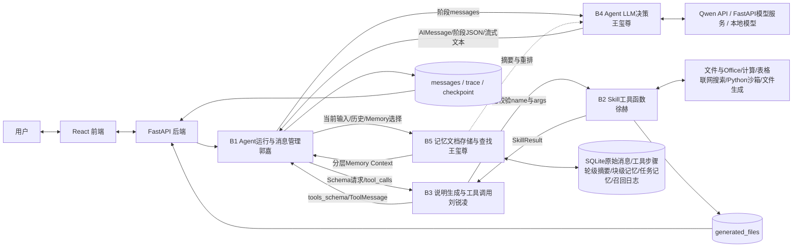
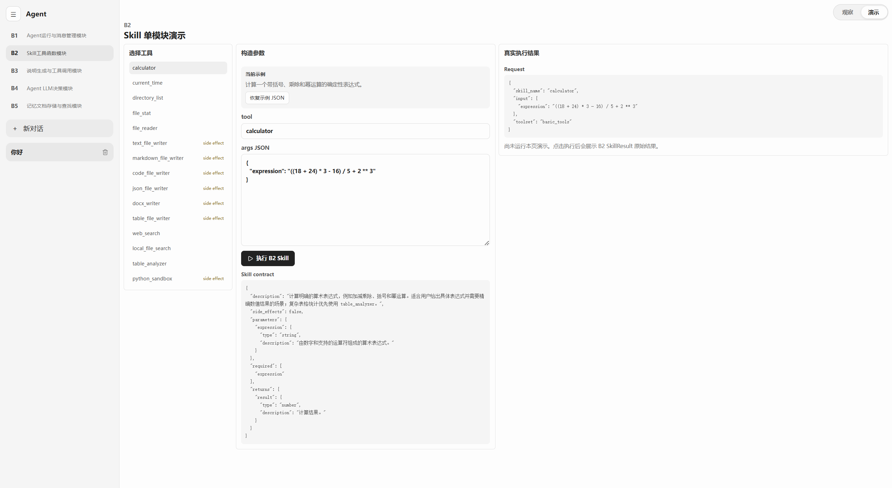
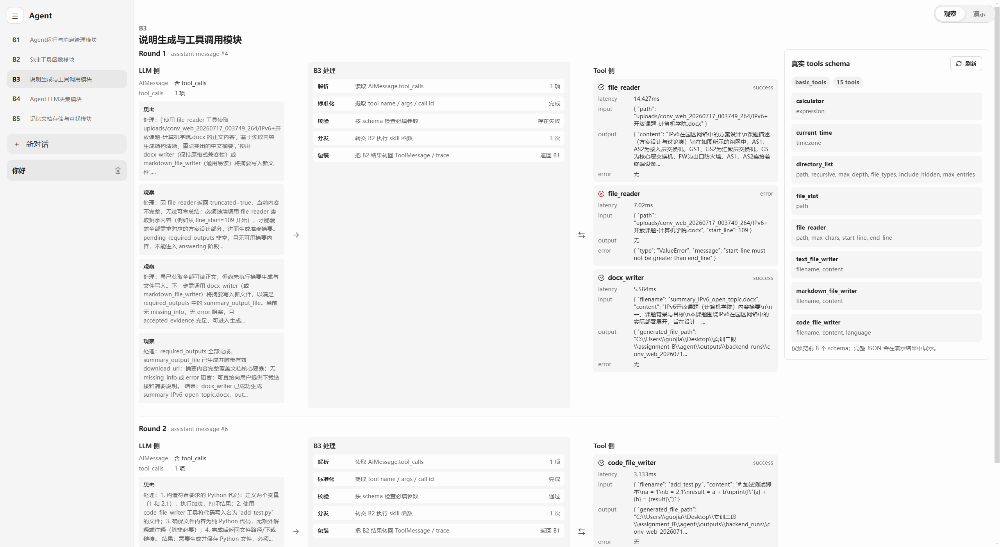
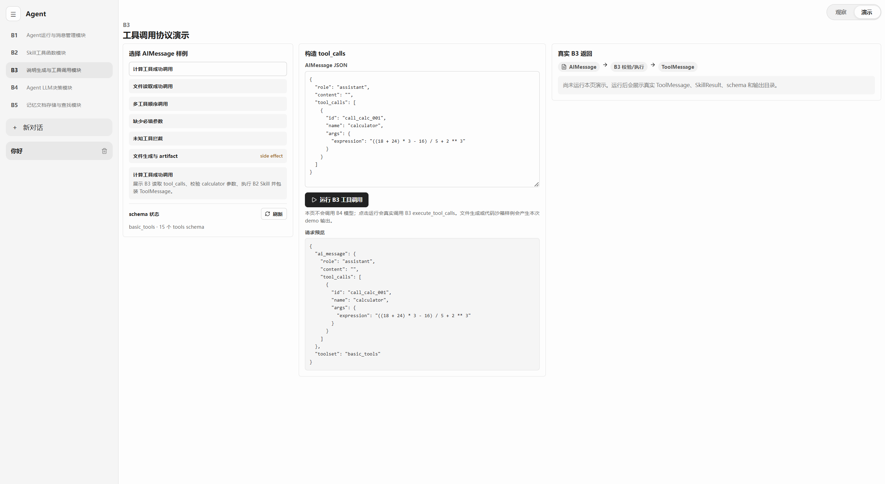
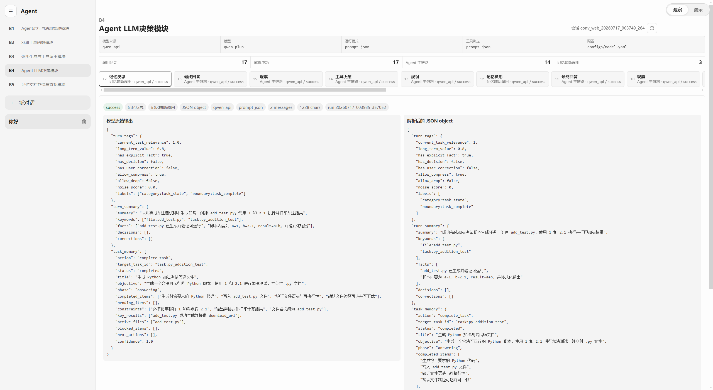
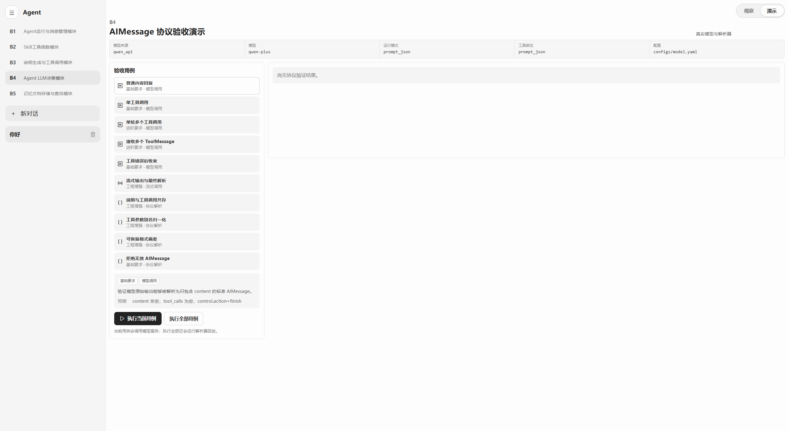
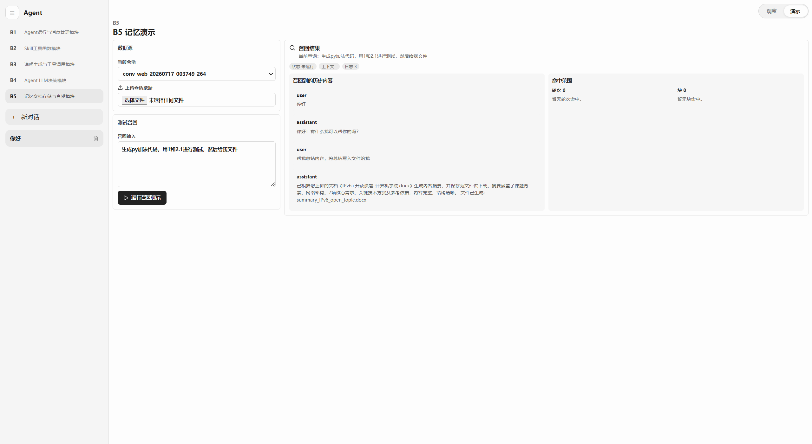
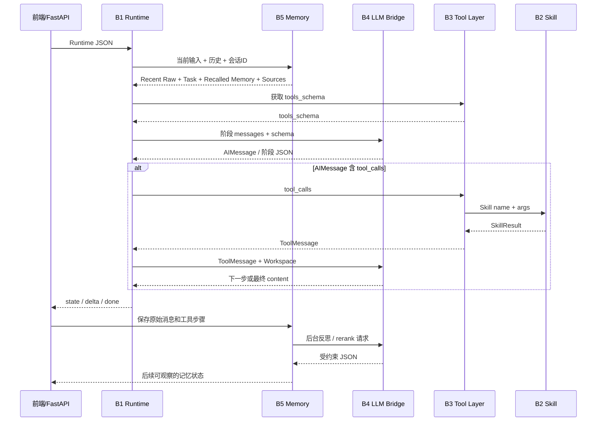

# 综合实训Ⅱ阶段 - 个人结题技术报告

> **报告人：王玺尊**
>
> **负责模块：B4 Agent LLM 决策模块、B5 记忆文档存储与查找模块**

---

## 一、项目与团队基本信息

- **本人姓名**：[王玺尊]
- **本人学号**：[20236481]
- **项目名称**：[B方向Agent智能体]
- **实际完成目标**：[完成 B1–B5 五模块基础链路并形成 React + FastAPI Web 系统；本人负责的 B4 完成多模型源、结构化 AIMessage、流式输出和协议容错，B5 完成 legacy 文档记忆、SQLite 分层记忆、轮级反思、任务记忆、记忆块、混合召回、向量检索、LLM 重排和来源回查等基础与进阶功能。]
- **小组其他成员**：[郭嘉、刘锐凌、徐赫]

### 成员最终分工与交付核对表

| 角色 | 姓名 | 学号 | 实际负责的核心模块 | 个人代码库链接 |
| :---: | :---: | :---: | :--- | :--- |
| **组长** | **王玺尊** | **20236481** | **B4 Agent LLM 决策、B5 记忆文档存储与查找；前端协作** | **[B4 源码](https://github.com/aaaprprpr/agent/blob/main/code/b4_local_agent_llm.py) / [B5 源码](https://github.com/aaaprprpr/agent/tree/main/code/b5_memory_parts)** |
| 组员 | 郭嘉 | 20236529 | B1 Agent 运行与消息管理；前端协作 | [B1 模块源码](https://github.com/aaaprprpr/agent/tree/main/code/b1_agent_runtime_parts) |
| 组员 | 刘锐凌 | 20236543 | B3 说明生成与工具调用 | [B3 模块源码](https://github.com/aaaprprpr/agent/blob/main/code/b3_tool_layer.py) |
| 组员 | 徐赫 | 20236513 | B2 Skill 工具函数 | [B2 模块源码](https://github.com/aaaprprpr/agent/tree/main/skills) |

---

## 二、整体系统架构与最终成果展示

### 2.1 最终系统总体架构图


| 组成部分               | 当前实现与团队成果                                                                                                                                                           |
| ---------------------- | ---------------------------------------------------------------------------------------------------------------------------------------------------------------------------- |
| React 前端             | 提供多轮对话、文件上传、流式回答、工具过程折叠区、产物下载、历史会话、回答终止/恢复、会话提示词编辑，以及 B1-B5 独立观察/演示页面。                                          |
| FastAPI 后端           | 提供NDJSON 流式接口、上传文件管理、会话查询/删除、System Prompt 更新、生成文件受限下载、取消/恢复，以及五模块演示 API；不承载核心 Agent 决策。                               |
| B1 Agent运行与消息管理 | 接收 Runtime 输入，组织标准消息和 Workspace，协调 B5、B3、B4，推进 Planning、Tool Calling、Observation、Answering，维护流式事件和 Checkpoint。                               |
| B2 Skill工具函数       | 提供独立、JSON可序列化的实际执行能力，包括文件/目录浏览、TXT/Markdown/Office读取、文件搜索、计算、当前时间、CSV/XLSX表格分析、DDGS联网搜索、多格式文件生成和受限Python沙箱。 |
| B3 说明生成与工具调用  | 从 `tools.yaml` 生成 OpenAI风格 Schema，检查工具名与必填参数，动态调用 B2并封装 ToolMessage；同时负责可恢复重试、结果缓存、调用日志、耗时统计和文件产物引用。                |
| B4 Agent LLM决策       | 读取 `model.yaml`，统一支持本地 Transformers、远端 FastAPI和 Qwen API代理；提供普通生成、流式生成和结构化 JSON生成，将原始模型输出解析为标准 AIMessage并保存调用产物。       |
| B5 记忆文档存储与查找  | 以 SQLite为当前主要实现，保存原始会话和工具步骤，生成轮级摘要、块级记忆和任务记忆；结合字段/关键词评分、向量召回与 LLM重排，为 B1构造带来源信息的 Memory Context。           |
| 模型与数据资源         | Qwen模型服务负责语言生成，Embedding接口服务于 B5向量召回；SQLite保存会话与分层记忆，`outputs/backend_runs/`保存模型、工具、Trace和生成文件等可核验产物。                     |

五个模块通过 JSON 数据协议协作，但仍保留各自的 CLI入口和独立演示能力。课程初始的 CLI 与 Markdown Memory 链路作为基础验收兼容入口保留，当前正式产品以 React + FastAPI + SQLite 的 Web 链路为主。


*图 2-1 系统总体架构。实线表示主数据流，虚线表示辅助调用*

### 2.2 系统整体运行流程与集成说明

一次完整 Web 对话按以下顺序执行：

1. 用户在 React 前端输入问题并可上传文件。FastAPI 后端保存附件，读取会话历史和会话级 System Prompt，组装标准 Runtime 输入。
2. B1 在规划前调用 B5。B5 根据会话编号、当前问题、近期历史和任务状态，返回近期原始消息、较早轮次、记忆块、任务记忆及来源证据。
3. B1 调用 B3 读取 `configs/tools.yaml` 并取得当前 `tools_schema`，再把当前阶段所需消息交给 B4。
4. B4 根据 `configs/model.yaml` 选择 `local`、`fastapi` 或 `qwen_api` 模型源，保存模型原始输出，并解析为标准 AIMessage 或阶段 JSON。
5. AIMessage 含 `tool_calls` 时，B1 将其交给 B3。B3 校验工具名和参数后调用 B2 Skill，把统一 SkillResult 封装为 ToolMessage 返回 B1。
6. B1 将工具结果写入 Workspace，重新调用 B4 观察证据、判断缺口，并在必要时继续工具循环；证据满足后进入最终回答阶段。
7. 最终回答以 NDJSON 流返回前端；生成文件通过受限 artifact 接口提供下载。
8. 后端保存原始消息与工具步骤，再异步触发 B5 反思。B5 生成轮摘要、任务状态和记忆块，为后续对话提供可回查来源的分层上下文。

团队采用“固定协议、独立实现”的方式。Runtime、AIMessage、ToolMessage、SkillResult、tools_schema和 Memory Context构成模块边界；配置文件分别由 `model.yaml`、`tools.yaml`和 `memory.yaml`管理。并保持模块职责可独立说明、独立运行和独立排错。

### 2.3 最终产品展示（Demo）


| B1模块观察界面                               | B1模块演示界面                               |
| -------------------------------------------- | -------------------------------------------- |
|  |  |

| B2模块观察界面                               | B2模块演示界面                               |
| -------------------------------------------- | -------------------------------------------- |
|  |  |

| B3模块观察界面                               | B3模块演示界面                               |
| -------------------------------------------- | -------------------------------------------- |
|  |  |

| B4模块观察界面                               | B4模块演示界面                               |
| -------------------------------------------- | -------------------------------------------- |
|  |  |

| B5模块观察界面                               | B5模块演示界面                               |
| -------------------------------------------- | -------------------------------------------- |
|  |  |

当前系统支持普通多轮问答、本地文件读取与总结、目录与文件搜索、表格分析、数学计算、当前时间、联网搜索、多种文件生成、轻量 Python 沙箱执行、回答中断恢复、历史会话读取及会话 System Prompt 编辑。


### 2.4 团队系统代码库

- **团队 GitHub 仓库**：[https://github.com/aaaprprpr/agent](https://github.com/aaaprprpr/agent)
- **团队项目 README**：[README.md](README.md)

---

## 三、个人核心模块技术报告（个人成绩核心依据）

### 3.1 模块定位与系统融合方式

#### 3.1.1 B4 在系统中的角色

我负责的 B4 是模型通信与输出协议层。Agent 系统不能直接依赖某个模型偶然生成的字符串格式：上游需要稳定地获得最终 content、一个或多个 tool_calls、控制状态和阶段信息，下游还需要保留 raw output 以定位模型错误。B4 将不同模型来源的通信差异封装在同一接口后面，并把不稳定的生成文本转换为受校验的标准消息。

没有 B4，B1 无法以统一方式连接本地 Qwen、远端 FastAPI 或 Qwen API，也无法可靠区分模型最终回答与工具调用请求；B3 即使具备工具执行能力，也得不到结构合法的 tool_calls。

#### 3.1.2 B5 在系统中的角色

我负责的 B5 是会话事实持久化和长期上下文检索层。基础 Agent 只依赖当前 messages 时，随着对话增长会遇到上下文过长、旧信息稀释、任务状态丢失和摘要无法核验等问题。B5 先保存原始消息与工具步骤，再生成摘要、任务和记忆块作为定位层；检索时结合字段评分、向量相似度和 LLM 重排，并回查原始来源。

没有 B5，浏览器历史只能作为不断增长的原始消息整体回灌给模型，无法兼顾近期原文、长期约定、任务进度、上下文预算和事实可追溯性。

#### 3.1.3 上下游依赖与接口协同

| 接口 | 上游输入 | 本模块处理 | 下游输出 |
|---|---|---|---|
| B1 → B4 | `messages`、`tools_schema`、模型配置、可选图片、`prompt_ready` | 模型调用、流式读取、协议解析和校验 | `{ai_message, status, error, raw_text, prompt_messages}` 返回 B1 |
| B1 → B4 阶段生成 | 规划/观察阶段 messages | `generate_json_object()` 生成并解析 JSON object | B1 使用的 planning、observation 等阶段结果 |
| B1/CLI → B5 legacy | memory ids、global 开关、query 或 save input | 索引校验、文档读取/保存、长度控制 | `selected_memory.json`、`saved_memory.json`、Markdown memory |
| 后端 → B5 事实存储 | conversation、message、tool step、trace | SQLite 持久化和完成轮次登记 | 原始事实表与稳定 id |
| B1/后端 → B5 召回 | conversation id、当前问题、历史消息、模型配置 | 候选评分、向量补分、rerank、来源加载和预算裁剪 | `workspace_memory_context` / `layered_memory_context` |
| 后端 → 前端 | B4 calls/protocol tests、B5 snapshot/recall preview | API 只读取真实产物或执行真实模块入口 | B4/B5 观察和演示页面 |



### 3.2 核心技术实现路径

#### 3.2.1 技术栈与模型配置

| 层次 | 采用方案 | 选择原因 |
|---|---|---|
| B4 主体 | 原生 Python、urllib、统一消息 schema | 保持课程模块可独立运行，不依赖完整 Agent 框架 |
| 默认生成模型 | `qwen_api/qwen-plus` | 本地算力不足时提供可用工程链路 |
| 课程本地模型方案 | `Qwen3.5-4B` + Transformers | 满足课程指定本地模型路径，配置可切换 |
| 远端服务 | FastAPI `/generate`、`/generate_stream` | 支持学校算力服务器或兼容服务 |
| B5 主存储 | Python `sqlite3` | 本地部署、事务明确、便于保存结构化来源关系 |
| Embedding | `text-embedding-v4`，经 `/embeddings` | 为较早记忆候选补充语义相似度 |
| Rerank | B4 `generate_json_object()` | 复用统一模型层，并以候选 id 约束输出 |
| 前端 | React + TypeScript + Vite | 分开展示主对话和 B1–B5 模块观察 |

当前默认 `qwen-plus` 与课程指定 `Qwen3.5-4B` 不是同一模型。报告中的 B4 历史用例结果仅对应当次 `qwen_api/qwen-plus` 配置；若最终验收要求本地模型，必须切换配置后重新运行并替换截图和结果。

系统的“推理—行动—观察”循环在工程思想上参考了 [ReAct](https://arxiv.org/abs/2210.03629)，B5 的分层上下文管理参考了 [MemGPT](https://arxiv.org/abs/2310.08560) 对有限上下文与层次化记忆的讨论；本项目是面向课程 B1–B5 接口的自主工程实现，不声称复现论文实验或指标。

#### 3.2.2 B4：从模型文本到标准 AIMessage

B4 的处理链分为四步：

1. **配置与消息准备**：读取 `configs/model.yaml`，规范模型来源、生成参数和最大输入 token；将 tools schema 与输出约束写入 prompt。
2. **统一生成**：本地路径使用 Transformers，远端路径使用 `/generate`，流式路径使用 `/generate_stream`。
3. **有限容错**：处理明确的字段别名、Markdown 尾标、纯文本 content 和局部可恢复 JSON；不根据业务关键词凭空发明工具调用。
4. **标准校验与留痕**：调用公共 `validate_ai_message()`，分别保存 raw record、标准 AIMessage 和 JSONL 日志。

B4 支持 AIMessage 同时包含 content 和 tool_calls，也支持单轮多个 tool_calls。工具调用是否执行、是否并行以及下一阶段是什么仍由 B1/B3 决定。


*图 3-1 B4 内部链路。模型只负责语义生成，B4 负责统一通信、保留 raw output、进行有限结构归一化并完成标准协议校验。*

#### 3.2.3 B5：事实层、定位层与召回层

B5 将会话记忆拆成三个层次：

- **事实层**：`conversations`、`messages`、`tool_steps` 保存不可被摘要覆盖的原始记录；
- **定位层**：`turns`、`turn_summaries`、`memory_blocks`、`task_memories` 保存主题、任务、决定、纠正、偏好和来源 id；
- **召回层**：根据当前问题和近期历史生成候选，结合字段/工具/任务/时间分数、向量相似度和受约束 rerank，最后回查 source messages/tool steps。

近期四轮保留原文。较早信息只在被选中时进入上下文，默认最多选择 3 个记忆块和 5 个轮摘要；最终文本受 `configs/memory.yaml` 中 `max_memory_chars` 限制。向量或 rerank 失败时回退到已有排序，B1 仍可使用近期原文继续回答。


*图 3-2 B5 分层记忆链。原始消息和工具步骤先持久化；摘要、任务和记忆块只作定位；精确事实在召回后回查 source message/tool step。*

#### 3.2.4 Prompt 工程

B4 不是只要求模型“输出 JSON”，还把不同任务拆成稳定协议：

- Agent 主链路的 tool calling 约束 content、tool_calls、control 和 agent_step；
- B1 planning/observation 使用 `prompts/b1_stage_prompts.json` 中的阶段 schema；
- B5 reflection 使用 `prompts/b5_memory_prompts.json`，要求生成 turn tags、summary 和 task memory decision；
- B5 rerank 只允许返回候选 block/turn id，输出不存在的 id 会被记录并忽略。

这样既保留模型的语义判断能力，又用程序校验限制消息形状、来源和状态。

#### 3.2.5 关键代码逻辑一：B4 工具参数与控制状态归一化

以下片段来自 `code/b4_local_agent_llm.py`。模型可能把工具参数写成 `arguments` 或 `parameters`；B4 将其归一化为团队统一的 `args`，再根据是否存在 tool_calls 规范 control，最后执行标准消息校验。

```python
normalized_control = None
raw_tool_calls = candidate.get("tool_calls", [])
raw_control = candidate.get("control")
if (not raw_tool_calls) and isinstance(raw_control, dict) \
        and isinstance(raw_control.get("tool_calls"), list):
    raw_tool_calls = raw_control.get("tool_calls", [])

if isinstance(raw_tool_calls, list):
    normalized_calls = []
    for call in raw_tool_calls:
        if not isinstance(call, dict) or "args" in call:
            normalized_calls.append(call)
            continue
        if "arguments" in call:
            normalized_calls.append({**call, "args": call.get("arguments")})
            continue
        if "parameters" in call:
            normalized_calls.append({**call, "args": call.get("parameters")})
            continue
        normalized_calls.append(call)
    raw_tool_calls = normalized_calls

# 此处省略对 control.state / action / reason 合法值的规范化。
message = {
    "role": "assistant",
    "content": content,
    "tool_calls": raw_tool_calls,
}
if normalized_control is not None:
    message["control"] = normalized_control
validate_ai_message(message)
```

该逻辑只修复结构别名，不修改工具名或业务参数内容。无法确认语义的损坏输出继续进入错误路径，避免解析器悄悄改变模型意图。

#### 3.2.6 关键代码逻辑二：B5 先保存来源，再生成定位信息

以下片段来自 `code/b5_memory_parts/reflection.py`。完成一轮后，B5 先建立 Turn 并提取原始消息和工具步骤 id；模型反思失败时采用中性 fallback，但无论哪种决策都保留来源，再分别写入标签、摘要、任务和记忆块。

```python
turn = upsert_conversation_turn(
    _conversation_db_path(config_path),
    conversation_id,
    run_id,
    user_message_id,
    assistant_message_id,
    status=trace.get("status", "unknown") if isinstance(trace, dict) else "unknown",
)
turn_id = turn["turn_id"]
tool_steps = list_message_tool_steps(config_path, assistant_message_id)
source_message_ids = [user_message_id, assistant_message_id]
source_tool_step_ids = [
    step["id"] for step in tool_steps if isinstance(step.get("id"), str)
]

try:
    decision = _reflect_memory_with_model(
        model_config, llm_mode, artifact_dir,
        raw_user_input, final_answer, trace, tool_steps,
        existing_tasks, source_message_ids, source_tool_step_ids,
    )
except Exception as exc:
    reflection_error = {"type": type(exc).__name__, "message": str(exc)}

if decision is None:
    decision = _neutral_memory_decision(
        raw_user_input, final_answer, trace,
        source_message_ids, source_tool_step_ids, tool_steps,
    )

tags_result = upsert_turn_memory_tags(
    _conversation_db_path(config_path),
    turn_id,
    decision["turn_tags"],
    source=decision.get("source", "neutral_fallback"),
)
summary_result = upsert_turn_summary(
    _conversation_db_path(config_path),
    turn_id,
    decision["turn_summary"],
    source=decision.get("source", "neutral_fallback"),
)
task_result = _apply_task_memory_decision(
    config_path, conversation_id, turn_id, decision["task_memory"]
)
block_result = _maybe_create_memory_block(config_path, conversation_id)
```

该设计把模型增强从“事实写入前提”降为“定位信息生成方式”。即使模型服务失败，原始会话仍然存在，后续召回也能明确看到 reflection error 和 fallback 来源。

#### 3.2.7 进阶挑战攻克

| 进阶挑战 | 实现方案 | 当前边界 |
|---|---|---|
| 单轮多个 tool_calls / 多 ToolMessage | B4 解析列表并保留调用 id；B1/B3 完成执行与 ToolMessage 对齐 | B4 不执行工具 |
| Plan-and-Execute | B1 workspace 分阶段编排，B4 提供 JSON/AIMessage 生成接口 | 属于项目级实现，不归为 B4 单模块独占 |
| 多模型来源 | `model.yaml` 手动选择 local/fastapi/qwen_api | 未实现按任务自动路由 |
| 协议容错 | 字段别名、可确认 JSON 片段、尾标和纯文本恢复 | 无法确认的输出保持错误 |
| Memory 长度管理 | 近期原文 + 轮摘要 + 3–8 轮记忆块 + 字符预算 | 少量对话不一定形成块 |
| 关键词与字段检索 | 文本、字段、工具、任务、长期价值和新近度混合评分 | 尚无冻结的 Recall@K 测试集 |
| 向量检索 | embedding 缓存 + cosine 相似度 + 加权分数 | 默认依赖外部 embedding 服务 |
| LLM Rerank | 只允许从候选 id 中选择；无效 id 记录 | 服务失败回退原排序 |
| Memory 更新 | task memory 支持前台、暂停、完成和放弃状态 | 任意文档的重复/补充/冲突合并尚不完整 |

### 3.3 最终结果与性能评估

#### 3.3.1 测试与验证方法

B4/B5 的验证重点不是只看最终自然语言是否“像答案”，而是检查协议、状态、来源和降级是否一致。

| 验证层次 | 输入 / 入口 | 核查内容 |
|---|---|---|
| B4 CLI | `messages_no_tool.json`、`messages_with_tool.json`、`messages_with_error_tool.json` | raw output、解析状态、标准 AIMessage 和错误收束 |
| B4 协议演示 | `/api/b4/protocol-tests/run` | 普通 content、单/多 tool_calls、多 ToolMessage、工具错误、流式、字段归一化和无效消息拒绝 |
| B4 观察页 | `/api/b4/calls`、`/api/b4/calls/detail` | 模型源、调用分类、prompt、raw output 与 AIMessage 对照 |
| B5 legacy CLI | `memory_index.json`、`memory_save_input.json` | 指定/全局记忆、字符预算、索引更新和 Markdown 保存 |
| B5 长对话 | 浏览器同一会话的多轮任务 | 近期原文、轮摘要、任务、记忆块及后台反思状态 |
| B5 召回预览 | `/api/b5/conversations/{id}/recall-preview` | 候选分数、向量、rerank、来源消息/工具步骤和降级状态 |
| 集成链路 | 前端真实对话 | B5 → B1 → B4 → B3/B2 → B4 → B5 完整闭环 |

#### 3.3.2 B4 已有协议用例结果

仓库当前本地运行目录中保存了可核查的 B4 协议演示结果。最新一次完整运行信息如下：

- **产物路径**：`outputs/backend_runs/b4_demo/20260715_142008_141656/b4_protocol_test_result.json`
- **模型源**：`qwen_api`
- **模型**：`qwen-plus`
- **工具绑定方式**：`prompt_json`
- **当次结果**：10 项通过，0 项失败

| 用例 | 类型 | 结果 | 当次耗时（ms） |
|---|---|---:|---:|
| `content_response` | 真实模型 | 通过 | 1064.047 |
| `single_tool_call` | 真实模型 | 通过 | 2187.945 |
| `multiple_tool_calls` | 真实模型 | 通过 | 1608.582 |
| `multiple_tool_messages` | 真实模型 | 通过 | 1202.999 |
| `error_tool_message` | 真实模型 | 通过 | 959.218 |
| `stream_response` | 真实模型 | 通过，收到 28 个 delta | 3462.468 |
| `content_with_tool_call` | 解析器 | 通过 | 0.062 |
| `normalize_parameters_alias` | 解析器 | 通过 | 0.035 |
| `recover_trailing_markers` | 解析器 | 通过 | 0.065 |
| `reject_empty_message` | 解析器 | 通过 | 0.024 |

六个真实模型用例的单次平均耗时为 **1747.543 ms**，范围为 **959.218–3462.468 ms**；四个纯解析用例平均耗时为 **0.0465 ms**。日志还保留了修正前 `20260714_103436_741498` 的 5/9 结果；完成参数别名归一化、纯文本 content 恢复、流式补发和 JSON 输出约束后，已有连续 **7** 次完整运行达到 10/10。该历史变化说明用例确实参与了协议缺陷定位，而不是只保留最终成功样例。


*图 3-3 最新一次 B4 协议用例结果。真实模型用例与本地解析器用例采用不同时间单位，避免微秒级数据在同一尺度下不可见。*

这些数值仅是一次本地运行的观察值，不是统计学性能结论：每个用例只有一次样本，耗时受网络、API 负载和模型服务影响，也不能代表 Qwen3.5-4B 本地模式。正式提交时如果模型配置改变，应重新运行并替换本节结果。

#### 3.3.3 B5 结果分析

B5 当前实现已经形成完整的功能证据链：

1. 原始消息与工具步骤先进入 SQLite，摘要不是唯一事实副本；
2. 完成轮次能够产生 turn tags、summary、task decision，并在满足边界时形成 memory block；
3. 新问题召回保留近期原文，从较早块/轮次中选择候选；
4. 召回结果公开非向量分数、vector status、rerank status 和来源 id；
5. embedding、rerank 或反思失败时保留错误并降级，不阻断主回答；
6. B5 页面能通过 snapshot 与 recall preview 展示真实数据库状态。

对 `memory/conversation_store.sqlite3` 的只读审计得到以下运行快照：

| 证据层 | 当前记录数 | 说明 |
|---|---:|---|
| 会话 / 原始消息 / 工具步骤 | 11 / 176 / 164 | 原始事实先于摘要持久化 |
| 完成轮次 / 轮标签 / 轮摘要 | 85 / 85 / 85 | 三者一一对应，轮级定位信息完整 |
| 记忆块 / 块—轮关联 | 17 / 61 | 已覆盖 `task_complete`、`task_key_change`、`context_length` 等成块边界 |
| 任务记忆 | 11 | 其中 9 条 completed、2 条 foreground |
| 召回日志 / 向量缓存 | 94 / 44 | 保存候选、选择、来源及 embedding 缓存状态 |
| 轮摘要来源 | 73 model / 10 heuristic / 2 neutral fallback | 能区分模型反思、旧规则数据与失败降级 |


*图 3-4 B5 当前数据库的分层证据规模及反思来源分布。数据来自 2026-07-17 对本地 SQLite 的只读统计，目的是证明存储、压缩、召回与降级链路确实产生了可核查记录。*

但当前没有冻结的“问题—相关记忆”标注集，无法严谨计算 Recall@K、MRR 或错误 Memory 对最终回答的定量影响。因此本报告不虚构 B5 检索准确率。正式结论暂以功能链路、来源可追溯性和降级行为为依据；后续应构造正确/错误 memory 对照集完成量化评估。

#### 3.3.4 完成度核对

| 模块要求 | 当前结论 | 证据 |
|---|---|---|
| B4 读取 model.yaml | 已实现 | `_load_model_config()`、`configs/model.yaml` |
| B4 接收 tools schema | 已实现 | `generate_ai_message()` / prompt 构造 |
| B4 解析 content 或 tool_calls | 已实现 | `_parse_model_output()`、`validate_ai_message()` |
| B4 保存 raw output 与 AIMessage | 已实现 | `_write_generation_artifacts()` |
| B4 多 tool_calls / 多 ToolMessage | 已实现协议支持 | B4 协议演示用例 |
| B4 Plan-and-Execute | 项目层实现 | B1 workspace 调用 B4 阶段接口 |
| B4 模型自动路由/协议对照/多模型统计 | 未完成 | 列入后续工作 |
| B5 配置、指定/全局文档和长度限制 | 已实现 | `legacy.load_memory()` |
| B5 索引与对话/全局文档保存 | 已实现 | `legacy.save_memory()` |
| B5 关键词/字段 top-k 和长度管理 | SQLite 主线已实现 | `retrieval.py`、`text_utils.py`、`reflection.py` |
| B5 向量检索 | 已实现，可降级 | `vector_retrieval.py` |
| B5 更新与冲突管理 | 部分完成 | task memory 更新；通用冲突合并未完成 |
| B5 错误 Memory 影响分析 | 未完成定量实验 | 有来源和日志，无对照数据集 |

#### 3.3.5 结果截图

本节复用 2.3 中的 B4/B5 真实观察截图，避免同一图片重复出现；量化结果分别由图 3-3 的 B4 协议用例图和图 3-4 的 B5 SQLite 运行快照补充。答辩现场应进一步展开 `multiple_tool_calls` 或 `stream_response` 用例，并在 B5 召回预览中展示 recalled block/turn 与 source messages/tool steps 的对应关系。

### 3.4 个人交付物清单

#### 3.4.1 源码与仓库

- **团队集成仓库**：[https://github.com/aaaprprpr/agent](https://github.com/aaaprprpr/agent)
- **B4 核心源码**：[code/b4_local_agent_llm.py](https://github.com/aaaprprpr/agent/blob/main/code/b4_local_agent_llm.py)
- **B5 公共入口**：[code/b5_memory.py](https://github.com/aaaprprpr/agent/blob/main/code/b5_memory.py)
- **B5 分层记忆实现**：[code/b5_memory_parts](https://github.com/aaaprprpr/agent/tree/main/code/b5_memory_parts)
- **SQLite 持久化实现**：[code/common/conversation_store.py](https://github.com/aaaprprpr/agent/blob/main/code/common/conversation_store.py)
- **个人模块源码链接**：[B4 决策模块](https://github.com/aaaprprpr/agent/blob/main/code/b4_local_agent_llm.py)、[B5 分层记忆模块](https://github.com/aaaprprpr/agent/tree/main/code/b5_memory_parts)、[个人模块 README](https://github.com/aaaprprpr/agent/blob/main/%E7%8E%8B%E7%8E%BA%E5%B0%8APERSONAL_README.md)
- **独立个人仓库** ：[个人模块独立仓库](https://github.com/lisnist/B_agent_12_6481)

#### 3.4.2 主要交付文件

| 交付物 | 说明 |
|---|---|
| `code/b4_local_agent_llm.py` | 模型来源、生成、流式、结构化 JSON 和 AIMessage 解析 |
| `code/b5_memory.py` | B5 公共 API 导出与 legacy CLI |
| `code/b5_memory_parts/legacy.py` | 课程基础文档记忆路径 |
| `code/b5_memory_parts/reflection.py` | 轮反思、任务记忆和记忆块 |
| `code/b5_memory_parts/retrieval.py` | 分层召回、来源加载、日志和 B1 上下文包 |
| `code/b5_memory_parts/vector_retrieval.py` | embedding、缓存和向量相似度 |
| `code/b5_memory_parts/rerank.py` | 受候选 id 约束的 LLM 重排 |
| `code/common/conversation_store.py` | SQLite 表结构和持久化函数 |
| `llm_backend/qwen_api/llm_fastapi_server.py` | Qwen API 本地代理和 embedding 接口 |
| `backend/b4_demo_service.py` | B4 观察与 10 项协议演示 |
| `frontend/src/B4*.tsx`、`B5ModuleView.tsx` | B4/B5 前端观察和演示页面 |
| `王玺尊PERSONAL_README.md` | 个人模块环境、接口、演示和已知问题说明 |

---

## 四、实训总结与心得体会

### 4.1 个人实训收获与挑战

#### 遇到的最大挑战

本次开发的最大挑战不是调用一次模型或把消息保存进数据库，而是同时处理“生成结果不稳定”和“长期记忆不可完全相信”两个问题。

B4 面对的真实模型输出并不总是严格符合约定：工具参数可能使用不同字段，content 与 tool_calls 可能共存，流式输出结束后仍需重建完整消息，损坏 JSON 还可能夹杂 Markdown 标记。如果解析器过于严格，系统频繁中断；如果过度修复，又会凭空改变模型意图。

B5 面对的是另一类不确定性：摘要会丢失细节，向量相似不等于事实正确，LLM rerank 可能选择不存在的 id，后台反思和远端 embedding 还可能失败。如果把摘要直接当事实或把外部模型作为单点依赖，长对话越多，错误越难定位。

#### 如何克服

我采用了以下方法逐步收敛问题：

1. 先重新确认 B1–B5 的职责边界，保证 B4 不执行工具、B5 不控制 Agent 流程；
2. 为 B4 同时保留 prompt、raw output、解析候选、标准 AIMessage 和 error，按层定位问题；
3. 将模型协议容错限制在“语义可确定”的结构修复，无法确认的输出显式失败；
4. 为 B4 构造真实模型用例和纯解析器用例，分别验证模型遵循度与本地协议逻辑；
5. 将 B5 拆成事实层、定位层和召回层，原始消息与工具步骤始终保留；
6. 为 summary、task 和 block 保存 source id，检索后回查原文；
7. 对 reflection、embedding 和 rerank 设计降级路径，并把降级原因写入日志；
8. 通过 B4/B5 观察页把后端真实产物展示出来，避免只依据最终回答猜测内部状态。

这些方案主要依据课程 B 方向模块说明、Qwen/OpenAI 兼容消息协议、FastAPI 接口实践、SQLite 数据建模以及 Git 中积累的真实失败产物持续迭代完成。团队联调中，B1、B2、B3 负责人分别帮助核对阶段输入、SkillResult 和 tool_calls 接口，使 B4/B5 能稳定接入完整系统。

#### 心得体会

本次实训让我认识到，Agent 工程的核心不是堆叠更多模型调用，而是建立可验证的协议、清晰的模块边界和完整的失败证据。

在模型层，Prompt 不能替代程序校验，程序规则也不能替模型完成语义决策。较合理的方式是让模型判断内容和下一步，让代码保证字段、来源、状态与错误可追踪。在记忆层，摘要不是事实数据库，向量相似也不是正确性证明；任何压缩和检索都应能回到原始消息与工具步骤。

在工程能力方面，我进一步掌握了多模型源适配、流式 HTTP、结构化输出解析、SQLite 模式设计、异步反思、向量缓存、候选重排、前后端可观察性和失败降级。在团队协作方面，稳定接口和明确所有权比在同一文件中快速增加功能更重要：跨模块修改必须尽量小，并通过 Git 历史、运行产物和模块 README 说明原因。

当前实现仍有清晰的改进空间，包括本地 Qwen3.5-4B 的最终复现、多模型/token 对照、Memory 冲突合并和错误 Memory 定量实验。报告没有把这些未完成项包装成完成结果，也没有用单次 10/10 用例外推模型的普遍可靠性。这种对证据边界的重视，是本次实训最重要的收获之一。